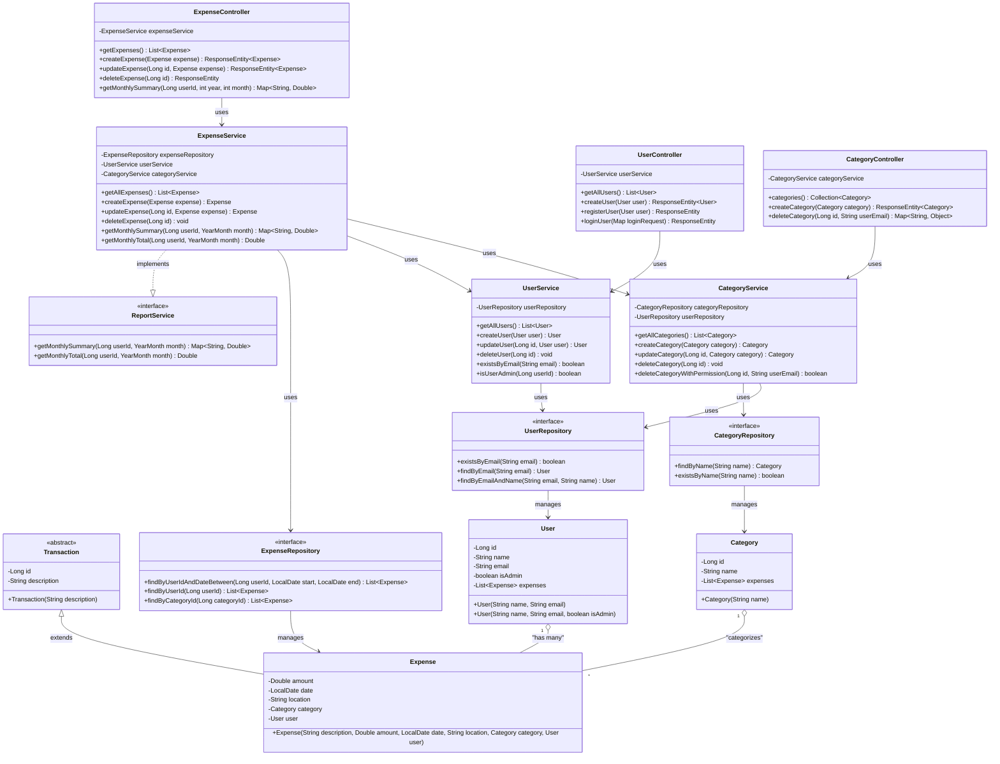
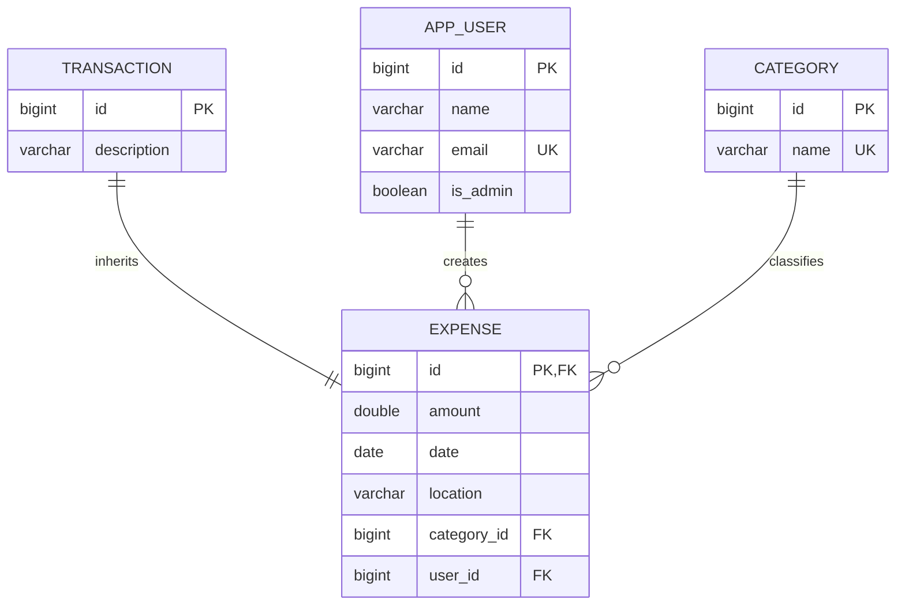
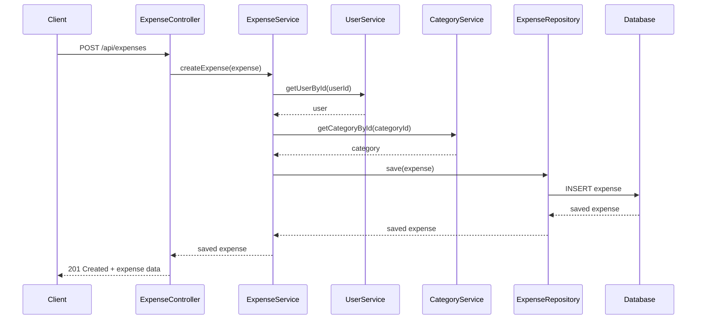

# ExpenseTracker Backend Documentation

## 📋 Table of Contents
1. [Overview](#overview)
2. [Architecture](#architecture)
3. [UML Diagrams](#uml-diagrams)
4. [Class Descriptions](#class-descriptions)
5. [Database Design](#database-design)
6. [API Endpoints](#api-endpoints)
7. [OOP Principles Implementation](#oop-principles-implementation)
8. [Setup Instructions](#setup-instructions)

## 🔍 Overview

The ExpenseTracker backend is a Spring Boot application that implements a comprehensive expense management system. Built with Java 17 and Spring Boot 2.7.18, it follows a layered architecture pattern with proper separation of concerns.

### Key Technologies
- **Framework**: Spring Boot 2.7.18
- **Language**: Java 17
- **Database**: H2 (development) / PostgreSQL (production)
- **ORM**: JPA/Hibernate
- **Build Tool**: Maven
- **Additional**: Lombok, Jackson

## 🏗️ Architecture

The application follows a clean **Layered Architecture** pattern:

```
Controller Layer → Service Layer → Repository Layer → Model Layer
```

- **Controller Layer**: REST endpoints and HTTP request handling
- **Service Layer**: Business logic and transaction management
- **Repository Layer**: Data access and persistence operations
- **Model Layer**: Entity definitions and data structures

## 📊 UML Diagrams

### Class Diagram



### Entity Relationship Diagram



### Sequence Diagram - Create Expense



## 📝 Class Descriptions

### Model Classes

#### Transaction (Abstract Base Class)
```java
@Entity
@Table(name = "transaction")
@Inheritance(strategy = InheritanceType.JOINED)
public abstract class Transaction
```
- **Purpose**: Abstract base class for all transaction types
- **Key Features**:
  - Uses JPA JOINED inheritance strategy
  - Provides common transaction properties (id, description)
  - Demonstrates inheritance OOP principle

#### Expense (Entity Class)
```java
@Entity
@Table(name="expense")
public class Expense extends Transaction
```
- **Purpose**: Represents a financial expense transaction
- **Key Features**:
  - Extends Transaction (inheritance)
  - Contains amount, date, location, category, and user relationships
  - Many-to-One relationships with User and Category
  - Implements proper encapsulation with Lombok annotations

#### User (Entity Class)
```java
@Entity
@Table(name="app_user")
public class User
```
- **Purpose**: Represents application users
- **Key Features**:
  - Contains user information (name, email, admin status)
  - One-to-Many relationship with Expense
  - Unique email constraint
  - Admin privilege system

#### Category (Entity Class)
```java
@Entity
@Table(name="category")
public class Category
```
- **Purpose**: Organizes expenses into different types
- **Key Features**:
  - Contains category information (name)
  - One-to-Many relationship with Expense
  - Unique name constraint

### Service Classes

#### ExpenseService
```java
@Service
public class ExpenseService implements ReportService
```
- **Purpose**: Business logic for expense operations
- **Key Features**:
  - Implements ReportService interface (polymorphism)
  - CRUD operations for expenses
  - Monthly reporting functionality
  - Validation and business rule enforcement

#### UserService
```java
@Service
public class UserService
```
- **Purpose**: Business logic for user management
- **Key Features**:
  - User CRUD operations
  - Authentication support
  - Admin privilege management
  - Email validation

#### CategoryService
```java
@Service
public class CategoryService
```
- **Purpose**: Business logic for category management
- **Key Features**:
  - Category CRUD operations
  - Permission-based deletion
  - Name uniqueness validation

### Repository Interfaces

#### ExpenseRepository
```java
@Repository
public interface ExpenseRepository extends JpaRepository<Expense, Long>
```
- **Purpose**: Data access for Expense entities
- **Custom Methods**:
  - `findByUserIdAndDateBetween()`: Date range queries
  - `findByUserId()`: User-specific expenses
  - `findByCategoryId()`: Category-specific expenses

#### UserRepository
```java
@Repository
public interface UserRepository extends JpaRepository<User, Long>
```
- **Purpose**: Data access for User entities
- **Custom Methods**:
  - `existsByEmail()`: Email uniqueness check
  - `findByEmail()`: Email-based lookup
  - `findByEmailAndName()`: Authentication support

#### CategoryRepository
```java
@Repository
public interface CategoryRepository extends JpaRepository<Category, Long>
```
- **Purpose**: Data access for Category entities
- **Custom Methods**:
  - `findByName()`: Name-based lookup
  - `existsByName()`: Name uniqueness check

### Controller Classes

#### ExpenseController
```java
@RestController
@RequestMapping("/api")
public class ExpenseController
```
- **Purpose**: REST endpoints for expense operations
- **Key Endpoints**:
  - `GET /expenses`: List all expenses
  - `POST /expenses`: Create expense
  - `PUT /expenses/{id}`: Update expense
  - `DELETE /expenses/{id}`: Delete expense
  - `GET /expenses/summary/{userId}/{year}/{month}`: Monthly summary

#### UserController
```java
@RestController
@RequestMapping("/api")
public class UserController
```
- **Purpose**: REST endpoints for user operations
- **Key Endpoints**:
  - `POST /auth/register`: User registration
  - `POST /auth/login`: User authentication
  - `GET /users`: List all users
  - `POST /users`: Create user
  - `PUT /users/{id}`: Update user
  - `DELETE /users/{id}`: Delete user

#### CategoryController
```java
@RestController
@RequestMapping("/api")
public class CategoryController
```
- **Purpose**: REST endpoints for category operations
- **Key Endpoints**:
  - `GET /categories`: List all categories
  - `POST /categories`: Create category
  - `PUT /categories/{id}`: Update category
  - `DELETE /categories/{id}`: Delete category (admin only)

### Interface

#### ReportService
```java
public interface ReportService
```
- **Purpose**: Interface for generating expense reports
- **Methods**:
  - `getMonthlySummary()`: Category-wise monthly summary
  - `getMonthlyTotal()`: Total monthly expenses
- **Implementation**: ExpenseService implements this interface

### Configuration

#### CorsConfig
```java
@Configuration
public class CorsConfig implements WebMvcConfigurer
```
- **Purpose**: CORS configuration for frontend integration
- **Features**:
  - Allows localhost:3000 origin
  - Supports all HTTP methods
  - Enables credentials

## 🗄️ Database Design

### Inheritance Strategy
The application uses **JOINED** inheritance strategy:
- `transaction` table: Base table with common fields
- `expense` table: Joined table with expense-specific fields
- Demonstrates proper OOP inheritance in database design

### Relationships
1. **User ↔ Expense**: One-to-Many (One user can have multiple expenses)
2. **Category ↔ Expense**: One-to-Many (One category can classify multiple expenses)
3. **Transaction ↔ Expense**: Inheritance (Expense extends Transaction)

### Constraints
- **Email Uniqueness**: User emails must be unique
- **Category Name Uniqueness**: Category names must be unique
- **Foreign Key Constraints**: Proper referential integrity
- **Not Null Constraints**: Essential fields cannot be null

## 🌐 API Endpoints

### Expense Endpoints
```
GET    /api/expenses                          - Get all expenses
GET    /api/expenses/{id}                     - Get expense by ID
POST   /api/expenses                          - Create expense
PUT    /api/expenses/{id}                     - Update expense
DELETE /api/expenses/{id}                     - Delete expense
GET    /api/expenses/user/{userId}            - Get user's expenses
GET    /api/expenses/category/{categoryId}    - Get category's expenses
GET    /api/expenses/summary/{userId}/{year}/{month} - Monthly summary
GET    /api/expenses/total/{userId}/{year}/{month}   - Monthly total
```

### User Endpoints
```
POST   /api/auth/register                     - Register new user
POST   /api/auth/login                        - Login user
GET    /api/users                             - Get all users
GET    /api/users/{id}                        - Get user by ID
POST   /api/users                             - Create user
PUT    /api/users/{id}                        - Update user
DELETE /api/users/{id}                        - Delete user
GET    /api/users/exists/email/{email}        - Check email existence
```

### Category Endpoints
```
GET    /api/categories                        - Get all categories
GET    /api/categories/{id}                   - Get category by ID
POST   /api/categories                        - Create category
PUT    /api/categories/{id}                   - Update category
DELETE /api/categories/{id}?userEmail=email   - Delete category (admin only)
GET    /api/categories/exists/name/{name}     - Check name existence
```

## 🎯 OOP Principles Implementation

### 1. Inheritance
- **Transaction → Expense**: Base class provides common transaction properties
- **JPA JOINED Strategy**: Proper inheritance mapping in database

### 2. Encapsulation
- **Private Fields**: All entity fields are private with public getters/setters
- **Data Validation**: Input validation at controller and service levels
- **Service Layer**: Business logic encapsulated in service classes

### 3. Polymorphism
- **ReportService Interface**: ExpenseService implements interface methods
- **JPA Repository**: Different repository implementations for different entities
- **Controller Methods**: Method overloading for different parameter types

### 4. Abstraction
- **Transaction Abstract Class**: Common interface for all transaction types
- **Repository Interfaces**: Abstract data access layer
- **Service Interfaces**: Abstract business logic definitions

### Design Patterns Used

#### 1. Repository Pattern
- Separates data access logic from business logic
- Provides a uniform interface for data operations

#### 2. Service Layer Pattern
- Encapsulates business logic
- Provides transaction management

#### 3. MVC Pattern
- Model: Entity classes
- View: JSON responses
- Controller: REST controllers

#### 4. Dependency Injection
- Spring's IoC container manages dependencies
- `@Autowired` annotations for dependency injection

#### 5. Strategy Pattern
- ReportService interface with different implementations
- Different report generation strategies

## ⚙️ Setup Instructions

### Prerequisites
- Java 17 or higher
- Maven 3.6 or higher
- IDE (IntelliJ IDEA, Eclipse, VS Code)

### Running the Application

1. **Clone the repository**
   ```bash
   git clone <repository-url>
   cd ExpenseTracker-React-Springboot
   ```

2. **Build the project**
   ```bash
   mvn clean install
   ```

3. **Run the application**
   ```bash
   mvn spring-boot:run
   ```

4. **Access the application**
   - Backend API: `http://localhost:8080`
   - H2 Console: `http://localhost:8080/h2-console`

### Database Configuration

#### Development (H2)
```properties
# application.properties
spring.datasource.url=jdbc:h2:mem:testdb
spring.h2.console.enabled=true
spring.jpa.hibernate.ddl-auto=create-drop
```

#### Production (PostgreSQL)
```properties
# application-prod.properties
spring.datasource.url=${DATABASE_URL}
spring.datasource.username=${DB_USERNAME}
spring.datasource.password=${DB_PASSWORD}
spring.jpa.hibernate.ddl-auto=update
```

### Testing
```bash
# Run unit tests
mvn test

# Run with coverage
mvn test jacoco:report
```

## 📚 Additional Features

### Security
- **Admin System**: Role-based access control
- **Permission Validation**: Double-layer security (frontend + backend)
- **Data Validation**: Input validation and sanitization

### Error Handling
- **Global Exception Handling**: Centralized error responses
- **Custom Exceptions**: EntityNotFoundException for missing resources
- **Validation**: Bean validation with proper error messages

### Logging
- **Application Logs**: Comprehensive logging throughout the application
- **Request Logging**: HTTP request/response logging

### Documentation
- **JavaDoc**: Comprehensive code documentation
- **API Documentation**: REST endpoint documentation
- **UML Diagrams**: Visual representation of system architecture

---

*This documentation provides a comprehensive overview of the ExpenseTracker backend architecture, focusing on the OOP principles and design patterns implemented throughout the system.*
